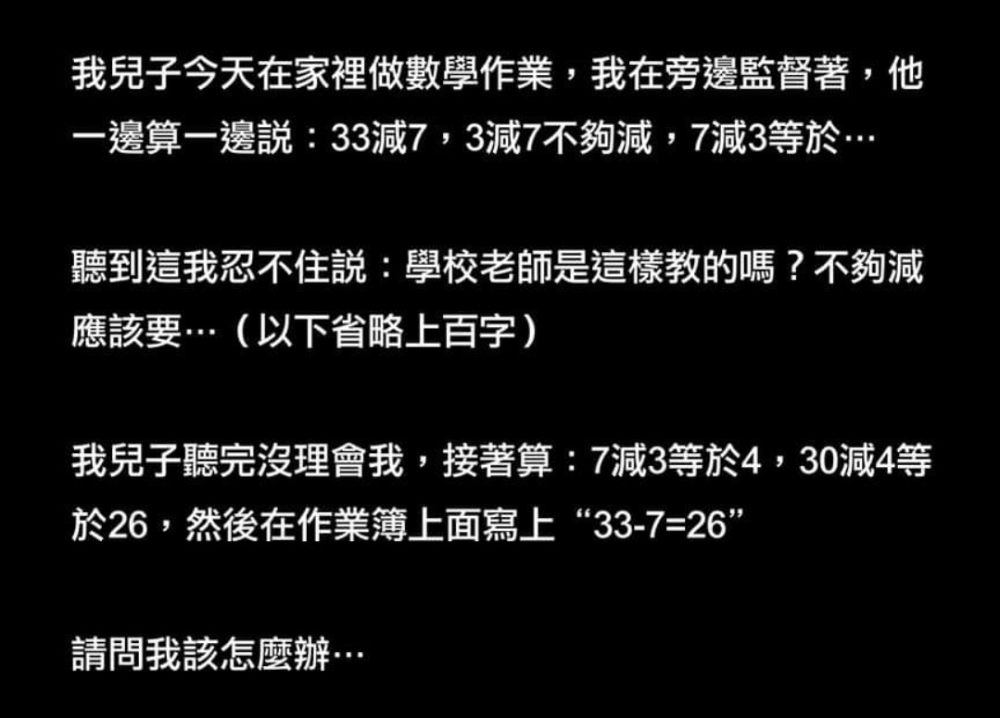

# Ziv

是到了該寫點什麼增加地球碳排放量的年紀了

***

## [拍照二三事](fa-xue-yuan-sheng-huo-shi-lu/xue-xiao-sheng-huo/pai-zhao-er-san-shi.md)

　　債各老師這週發火，因為有同學上課一直拿手機拍黑板。其實，拍黑板的事老師之前就強調過了：不要錄影、等他離開中間時再拍。但是這次是－－非。常。鄭。重。的說不要這樣！不過，我最欣賞的是，老師直接說：「我不喜歡！」非常好！比起冠冕堂皇的說什麼些什麼理由解釋，直接說出心裡的感受，才是最重要最真實的原因。

　　我好像可以理解這種不自在 ……

[( …… )](fa-xue-yuan-sheng-huo-shi-lu/xue-xiao-sheng-huo/pai-zhao-er-san-shi.md)

***

## [好像看到自己](fa-xue-yuan-sheng-huo-shi-lu/xue-xiao-sheng-huo/hao-xiang-kan-dao-zi-ji.md)

　　在以前當 TA，家教，或是補習班老師時候，常常在想像：如果我是我學生，到底有沒有聽懂我在講什麼？我這樣的說話方式，學生聽起來覺得如何？

　　很神奇，我在這次校園生活的這學期一門課上，彷彿看到自己在講課。哈哈哈

[( ...... )](fa-xue-yuan-sheng-huo-shi-lu/xue-xiao-sheng-huo/hao-xiang-kan-dao-zi-ji.md)

***

## [建構式數學](wo-bu-hui-jiao-xiao-hai/jiao-shu-xue/jian-gou-shi-shu-xue.md)

<figure><figcaption></figcaption></figure>

　　認真說起來我第一眼看到的時候真的有倒抽一口氣，結果 ......

[( ...... )](wo-bu-hui-jiao-xiao-hai/jiao-shu-xue/jian-gou-shi-shu-xue.md)

***

## [薄荷巧克力 チョコミント](zan-zan-hao-wu/chi-chi-he-he/chokominto.md)

　　忘記怎麼開始喜歡上薄荷巧克力的，應該不是因為他是綠色的吧？可能是小時候非常躁熱，普通冰淇淋無法降溫，都要吃超級幹爆涼爽勁直沖天門的薄荷口味吧？

　　這邊記錄我吃過推薦的薄荷巧克力冰淇淋或雪糕，以及根本就是在吃牙膏的爆雷款。

#### 超級推推 

Baskin-Robbins ( 31 冰淇淋 )

Maccanti ( 馬卡諦 )

[( ...... )](zan-zan-hao-wu/chi-chi-he-he/chokominto.md)

***

## [<mark style="color:blue;">本院不懂讀心術</mark>](hao-hao-xiao-de-pan-jue-shu/min-shi/ben-yuan-bu-dong-du-xin-shu.md)

直接節錄笑點：

這是一個常見且無用的抗辯，我不用當法官，平常聽到就懶趴火了。「我不清楚契約內容，我不知道我簽了什麼。」這麼好騙，你會不會哪天就簽個房屋贈與契約給我？

> ... 沒有證據可以證明被告不知道自己簽了什麼（**畢竟本院不懂讀心術**），而且對於意識清醒的人來說，**「不知道自己簽了什麼」並不是否認契約成立的正當理由**，因為這無異於主張自己是在沒有看清楚、問清楚、想清楚的狀況下先簽再說，事後發現契約對自己不利，再用自己簽約時的不看、不問、不懂為由，否認契約的拘束力，這無異是把誠信兩字丟到糞坑裡。**被告不要誠信，本院還要。**

[<mark style="color:blue;">( ...... )</mark>](hao-hao-xiao-de-pan-jue-shu/min-shi/ben-yuan-bu-dong-du-xin-shu.md)

***

## [<mark style="color:blue;">法學就很像數學？</mark>](ji-guang-pian-yu/xin-de-jiao-la/fa-xue-jiu-hen-xiang-shu-xue.md)

　　由於年紀也差不多了，認識的人除了討論買房外最多的話題就是小孩（薪水獎金其實也沒什麼好說了，大家混久就彼此知道了）。開始會討論要不要送私立小學、上了什麼才藝班……之類的，我覺得沒什麼好談的議題。

　　沒什麼好談不是我認為這些話題對小孩不重要，而是對於要透過這些方法達到的目的不重要。

[<mark style="color:blue;">( ...... )</mark>](ji-guang-pian-yu/xin-de-jiao-la/fa-xue-jiu-hen-xiang-shu-xue.md)

***

### 文章列表

[拍照二三四](fa-xue-yuan-sheng-huo-shi-lu/xue-xiao-sheng-huo/pai-zhao-er-san-shi.md) _May 07, 2024_

[好像看到自己](fa-xue-yuan-sheng-huo-shi-lu/xue-xiao-sheng-huo/hao-xiang-kan-dao-zi-ji.md) _April 09, 2024_

[建構式數學](wo-bu-hui-jiao-xiao-hai/jiao-shu-xue/jian-gou-shi-shu-xue.md) _April 07, 2024_

[薄荷巧克力 チョコミント](zan-zan-hao-wu/chi-chi-he-he/chokominto.md) _March 30, 2024_

[本院不懂讀心術](hao-hao-xiao-de-pan-jue-shu/min-shi/ben-yuan-bu-dong-du-xin-shu.md) _March 29, 2024_

[法學就很像數學？](ji-guang-pian-yu/xin-de-jiao-la/fa-xue-jiu-hen-xiang-shu-xue.md) _March 29, 2024_

[望子成龍，不如我成龍](wo-bu-hui-jiao-xiao-hai/guan-cha-ti-hui/wang-zi-cheng-long-bu-ru-wo-cheng-long.md) _March 27, 2024_

[鮮奶冰淇淋](zan-zan-hao-wu/chi-chi-he-he/xian-nai-bing-qi-lin.md) _March 27, 2024_

***

### 好用連結

[勞工常見問題](https://laborlaw.imziv.tw)

***
