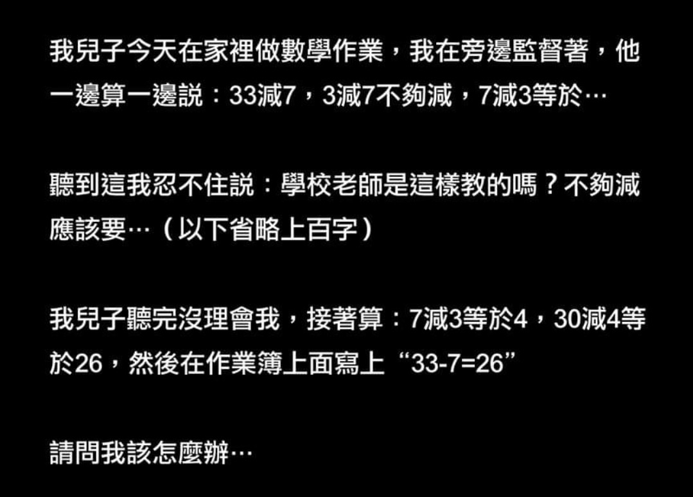

# Ziv

***

**Status**

* 在思考下一個職位該往什麼方向
* 取得第 3 個學位了 = 法學士 + 理學碩 + 理學士

**Interests**

勞動法、行動通訊、嵌入式系統

**Reading**

* 《我32次的放療，與吃喝玩樂》 / 黃榮堅

**Thinking**

* 怎樣才能早日達成自給自足？

**Place**

* [高野山(こうやさん) 拜訪大師 2](zan-zan-hao-wu/xiu-xian-yu-le/kouyasan-2.md)
* [高野山(こうやさん) 拜訪大師 1](zan-zan-hao-wu/xiu-xian-yu-le/kouyasan-1.md)

**Food**

* [薄荷巧克力 チョコミント](zan-zan-hao-wu/chi-chi-he-he/chokominto.md)
* 柚子胡椒

**Belief**

* Only basic, no magic.
* 學習基礎科學出身，堅信應該學習原理原則掌握架構，自然可以應對變幻莫測的世界。\
  有了堅實的基底，至於要往什麼方向就隨心所欲，想要就去行動。

***

***

## 私心偏愛

### [遇到不當解雇應如何處理](sheng-huo-fa-l/lao-dong-xiang-guan/yu-dao-bu-dang-jie-gu-ying-ru-he-chu-li.md)

1. 用存證信函表示拒絕離職，並以言詞提出勞務給付。

[( ...... )](sheng-huo-fa-l/lao-dong-xiang-guan/yu-dao-bu-dang-jie-gu-ying-ru-he-chu-li.md)

***

### [怪醫豪斯 House, M.D](zan-zan-hao-wu/xiu-xian-yu-le/guai-yi-hao-si-house-m.d.md)

　　很少看醫療劇。這是我第一部看的醫療美劇，美國上映年分約：2004～2012。2024年初在 Taiwan Netflix上架。

　　吸引我開始看這部長壽老劇的原因是有人說：這是一部辦公室政治劇。確實，在這部劇中，你可以從各種層面看到向上管理的手段，包含：各個團隊成員、中階主管 House、甚至是高階主管 Cuddy。我相信 ......

[( ...... )](zan-zan-hao-wu/xiu-xian-yu-le/guai-yi-hao-si-house-m.d.md)

***

### [高階健檢](zan-zan-hao-wu/shen-ti-jian-kang/gao-jie-jian-jian.md)

考完期末考後，到台北醫學大學附設醫院健康管理中心體驗了高階健檢。其實一直都很想要花錢做看看，但一直都沒真的行動，想說每年有公司健檢就好，就拖到了今年。真的讓我動手預約的原因是：《這個，我不推》的主持人——Yuli 發現身體有狀況。我自己有些檢查其實也沒有認真在做，來去醫院用儀器檢查吧！

　　健檢這件事一直都有在規劃，因為 ......

[( ...... )](zan-zan-hao-wu/shen-ti-jian-kang/gao-jie-jian-jian.md)

***

### [建構式數學](wo-bu-hui-jiao-xiao-hai/jiao-shu-xue/jian-gou-shi-shu-xue.md)

<figure><figcaption></figcaption></figure>

　　認真說起來我第一眼看到的時候真的有倒抽一口氣，結果 ......

[( ...... )](wo-bu-hui-jiao-xiao-hai/jiao-shu-xue/jian-gou-shi-shu-xue.md)

***

### [<mark style="color:blue;">本院不懂讀心術</mark>](you-yi-si-de-pan-jue/hao-hao-xiao-de-pan-jue-shu/min-shi/ben-yuan-bu-dong-du-xin-shu.md)

直接節錄笑點：

這是一個常見且無用的抗辯，我不用當法官，平常聽到就懶趴火了。「我不清楚契約內容，我不知道我簽了什麼。」這麼好騙，你會不會哪天就簽個房屋贈與契約給我？

> ... 沒有證據可以證明被告不知道自己簽了什麼（**畢竟本院不懂讀心術**），而且對於意識清醒的人來說，**「不知道自己簽了什麼」並不是否認契約成立的正當理由**，因為這無異於主張自己是在沒有看清楚、問清楚、想清楚的狀況下先簽再說，事後發現契約對自己不利，再用自己簽約時的不看、不問、不懂為由，否認契約的拘束力，這無異是把誠信兩字丟到糞坑裡。**被告不要誠信，本院還要。**

[<mark style="color:blue;">( ...... )</mark>](you-yi-si-de-pan-jue/hao-hao-xiao-de-pan-jue-shu/min-shi/ben-yuan-bu-dong-du-xin-shu.md)

***

## 最近文章

[遇到不當解雇應如何處理](sheng-huo-fa-l/lao-dong-xiang-guan/yu-dao-bu-dang-jie-gu-ying-ru-he-chu-li.md)  _July 17, 2025_

[勞工可以轉寄資料到私人信箱嗎](sheng-huo-fa-l/lao-dong-xiang-guan/lao-gong-ke-yi-zhuan-ji-zi-liao-dao-si-ren-xin-xiang-ma.md)  _June 25, 2025_

[如何到法院登記：約定財產制](sheng-huo-fa-l/qin-shu-ji-cheng/ru-he-dao-fa-yuan-deng-ji-yue-ding-cai-chan-zhi.md)  _June 24, 2025_

[高中與大學的斷裂](fa-xue-yuan-sheng-huo-shi-lu/xue-xiao-sheng-huo/gao-zhong-yu-da-xue-de-duan-lie.md)  _January 02, 2025_

[高野山(こうやさん) 拜訪大師 2](zan-zan-hao-wu/xiu-xian-yu-le/kouyasan-2.md)  _October 03, 2024_

[高野山(こうやさん) 拜訪大師 1](zan-zan-hao-wu/xiu-xian-yu-le/kouyasan-1.md)  _September 25, 2024_

***

## 好用連結

[勞工常見問題](https://laborlaw.imziv.tw)

***
