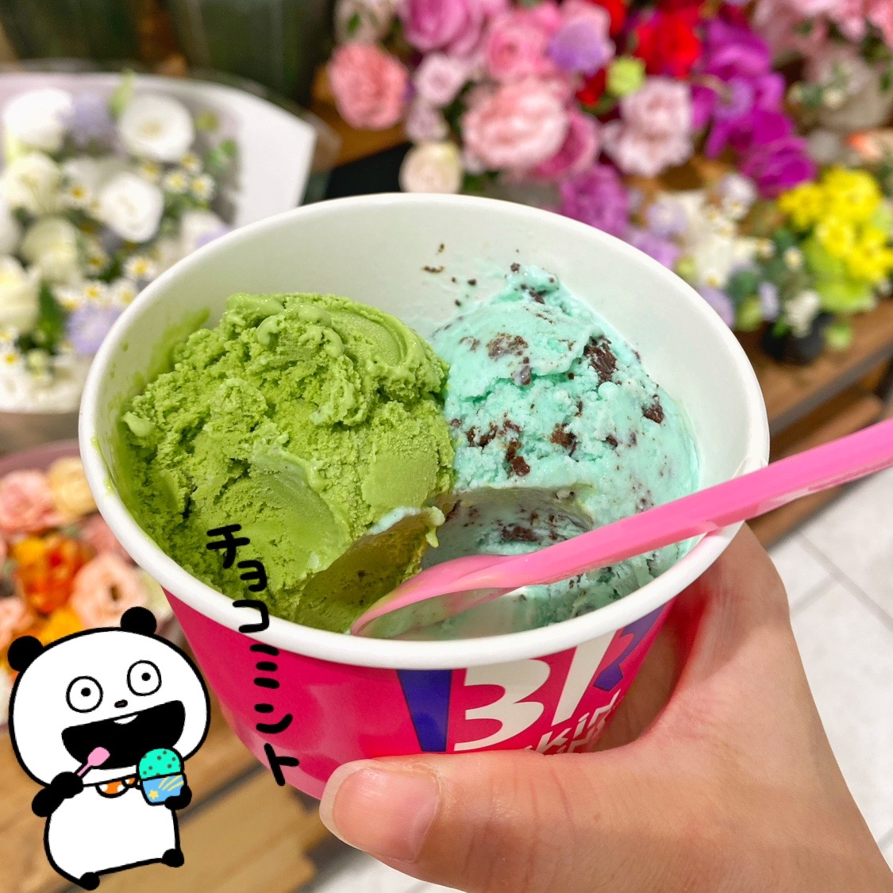
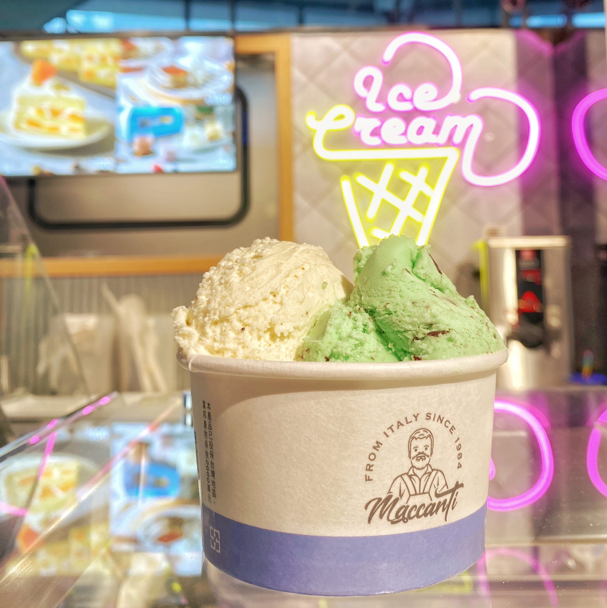
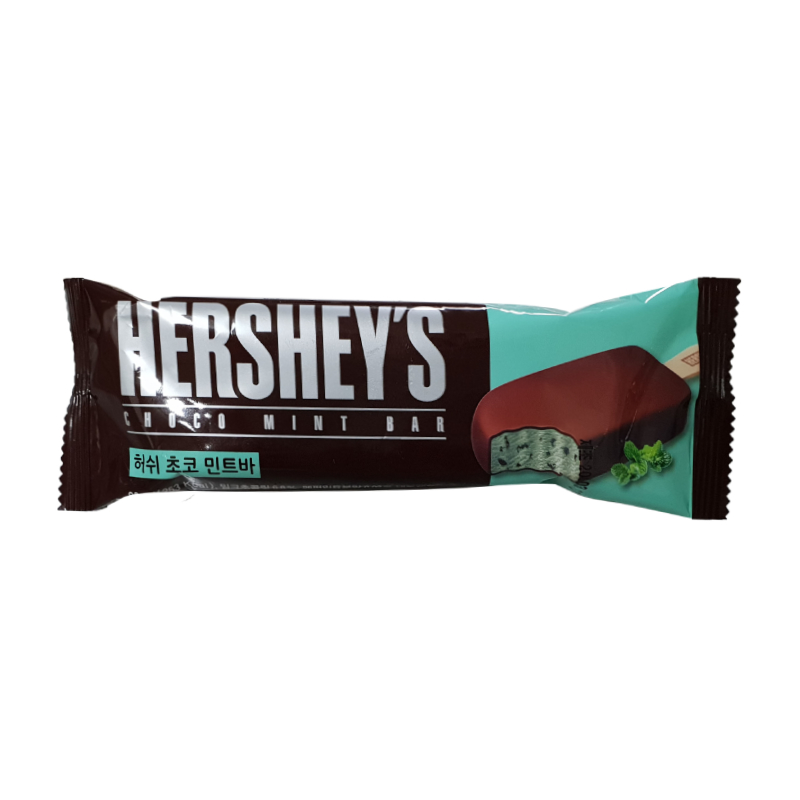

# 薄荷巧克力 チョコミント

　　忘記怎麼開始喜歡上薄荷巧克力的，應該不是因為他是綠色的吧？可能是小時候非常躁熱，普通冰淇淋無法降溫，都要吃超級幹爆涼爽勁直沖天門的薄荷口味吧？

　　這邊記錄我吃過推薦的薄荷巧克力冰淇淋或雪糕，以及根本就是在吃牙膏的爆雷款。

### 超級推推

**Baskin-Robbins ( 31 冰淇淋 )**

<figure><figcaption>
Baskin-Robbins ( 31 冰淇淋 )
</figcaption></figure>

薄荷跟巧克力蠻調和的，吃起來清爽不奶不膩。

**Maccanti ( 馬卡諦 )**

<figure><figcaption>
<strong>Maccanti ( 馬卡諦 )</strong>
</figcaption></figure>

這是我最喜歡的一家。薄荷夠涼但不會像牙膏，巧克力很香，冰淇淋的口感是較硬，我很喜歡。

### 牙膏我不行

**莫凡彼 Mövenpick**

　　我是在餐廳裡吃桶裝冰淇淋挖出來的。嗯……牙膏，很容易化。

**Hershey's**

<figure><figcaption>
Hershey's
</figcaption></figure>

　　就……薄荷跟巧克力外殼很不搭。

**杜老爺桶裝**

　　嗯……牙膏。

_March 30, 2024_
