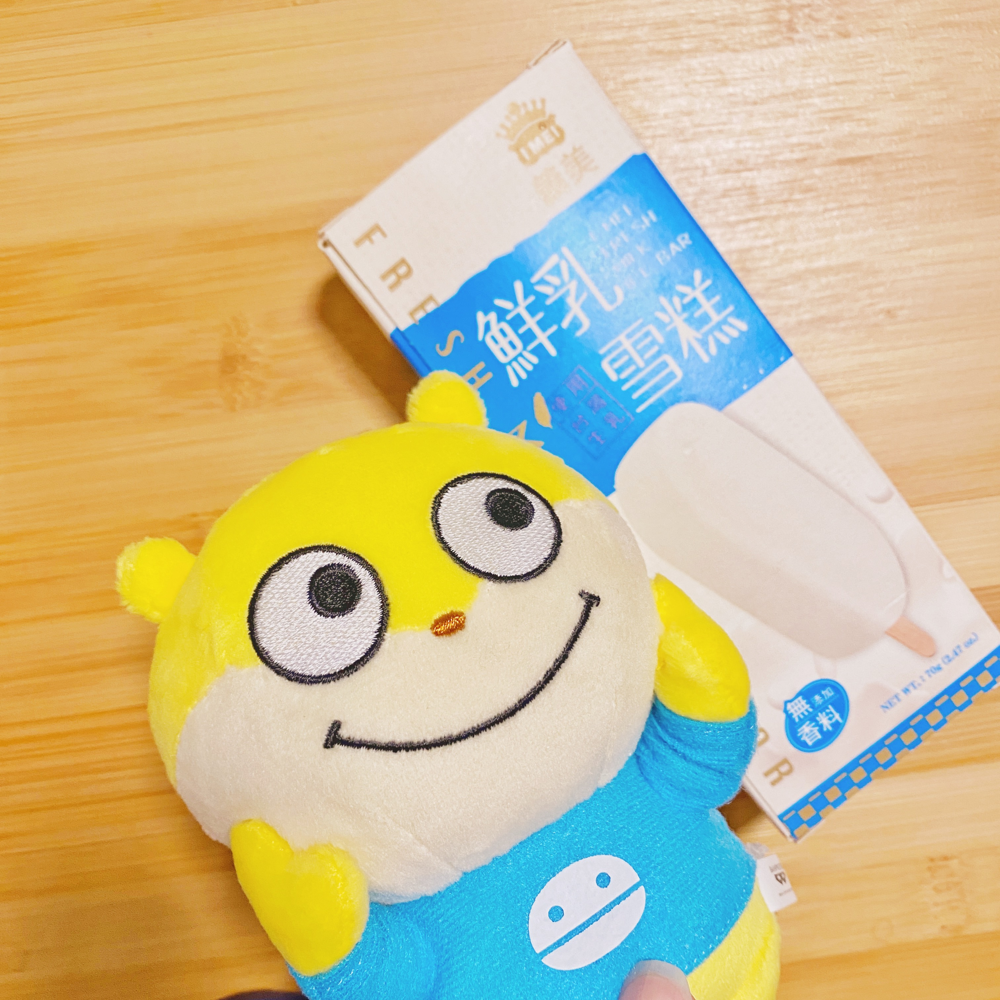
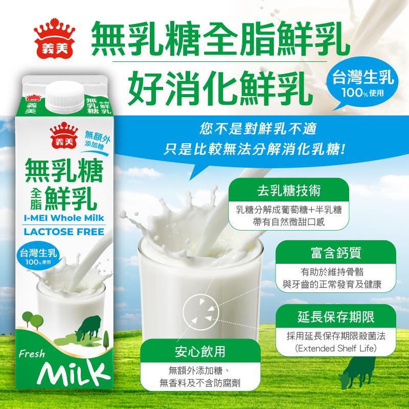
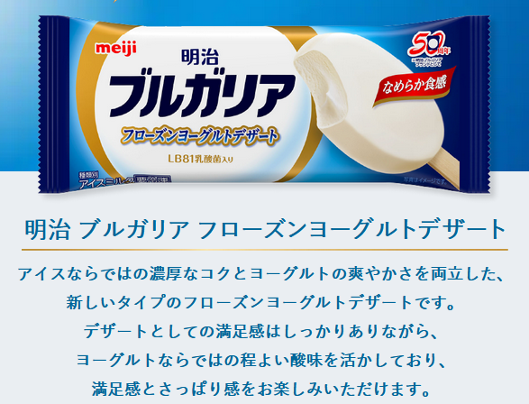

# 鮮奶冰淇淋

今天要推薦的是【義美鮮乳雪糕】

<figure><figcaption>
雪糕與美意識
</figcaption></figure>

　　一直以來我都很喜歡吃牛奶雪糕，特別是沒有添加其他風味的鮮乳雪糕。這趟義美採購主要是要尋找最新推出的【無乳糖全脂鮮乳900ml】。

<figure><figcaption>
無乳糖全脂鮮乳900ml  - 來自義美臉書
</figcaption></figure>

　　這款鮮乳是專門為－－不易消化乳糖者－－而設計的。沒有額外加糖就有淡淡的甜味、不會太奶。也許有些人會覺得不夠濃醇。但我可能台灣的鮮奶喝習慣了，風味乾淨簡單我反而比較喜歡，如果喜歡日本的鮮奶，可能會不太習慣這產品。但我自己直接拿來加入美式咖啡或是義美出的低糖紅茶都非常地搭。

　　回到主題，買無乳糖鮮乳外，還帶了鮮乳雪糕。以往鮮乳雪糕我都是吃明治Meiji家的。

<figure><figcaption>
ブルガリア フローズンヨーグルトデザート
</figcaption></figure>

　　如果你喜歡濃厚奶味的層次豐富的雪糕，那你千萬不要錯過這支。相較起來，義美的鮮乳雪糕也是乾淨明亮，吃起來很清爽。我感覺運動完的汗水都被一陣清風帶走。推薦給即將進入夏天，運動完滿身是汗，想吃隻鮮乳雪糕的朋友－－【義美鮮乳雪糕】
