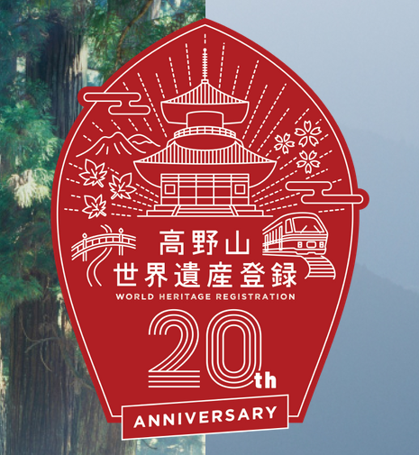
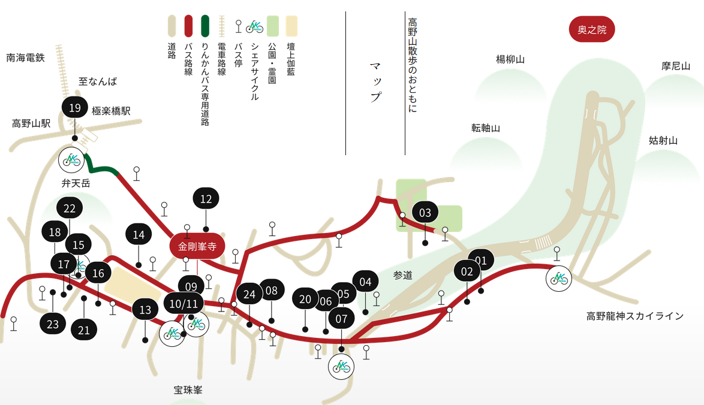
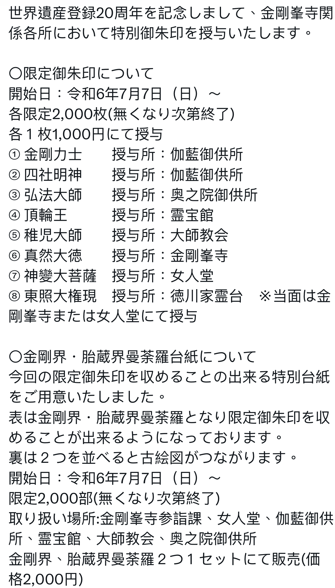

# 高野山(こうやさん) 拜訪大師 1

今年是「紀伊山地の霊場と参詣道」登錄世界遺產20周年。

　- [世界遺産「紀伊山地の霊場と参詣道」登録20周年記念](https://www.wakayama-kanko.or.jp/features/20th-koyasan-kumano/)

　- [高野山世界遺產登錄20周年](https://otent-nankai.jp/feature/koyasan20th/index.html)

<figure><figcaption></figcaption></figure>

### 簡介

　　和歌山縣其實很大，大概可以分幾個區塊：和歌山市、白濱、熊野古道、高野山。這趟旅行主要是去高野山町拜訪大師。同時，因為世界遺產登錄20周年，高野山的景點有提供限量的御朱印，加上，2024.08.28 剛好是甲子日，也是大黑天的緣日，所以早在前一年就訂好機票了。

　　這個地圖就是主要活動範圍，基本上只要搭纜車到高野山駅之後，有公車可以進到「大門」（大約是17、18、23），之後這個區域都可以步行，非常愜意。

<figure><figcaption></figcaption></figure>

<figure><figcaption></figcaption></figure>

### 限量御朱印

<figure><figcaption></figcaption></figure>

### 建議規劃

　　我們是在高野山的宿坊住了３個晚上，也就是４天３夜，但其實有一整個下午都在宿坊休息，非常悠哉。但我認為可能３天２夜比較會是恰到好處的長度。

　　在這區域我們移動都是步行。其實也是有公車，但沒必要，你可以發現很多外國人（我也是XD）其實都用走的。每個景點都可以慢慢走、吹吹風、聽聽樹葉的聲音。

### 務必要做的事

* 拜訪奧之院
* 阿字觀
* 住宿坊＋精進料理

好吃的餐廳以及詳細介紹在下篇。

_September 25, 2024_
