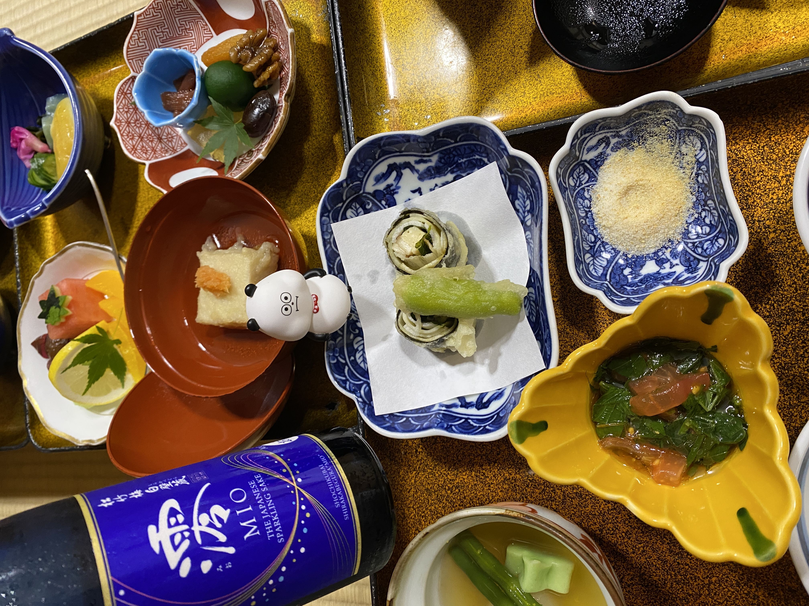
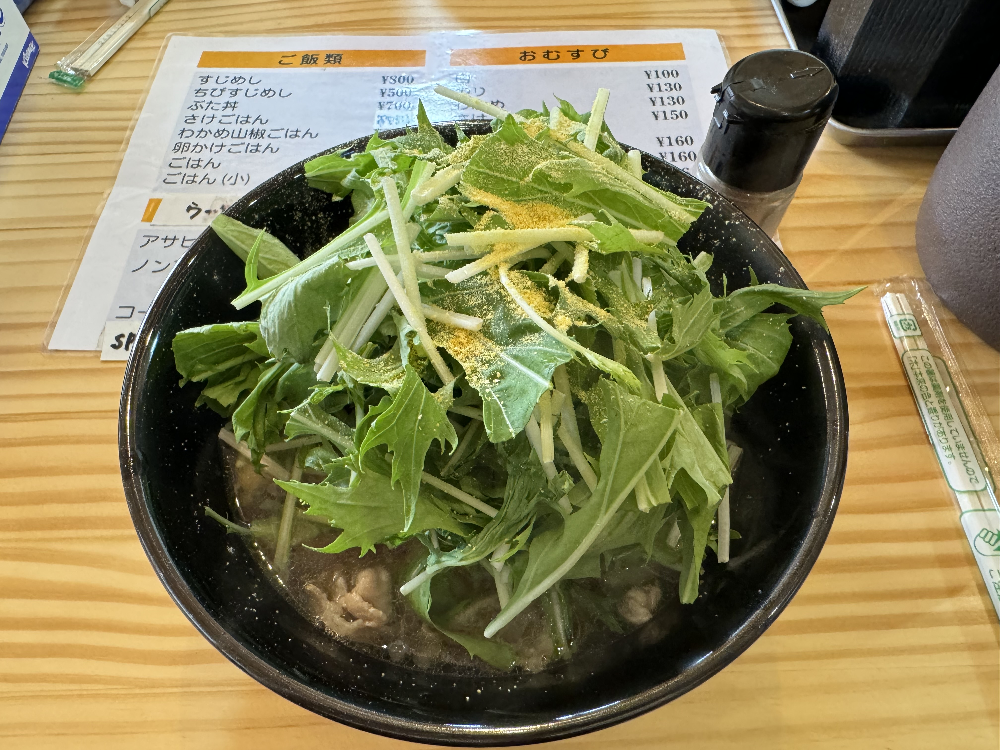
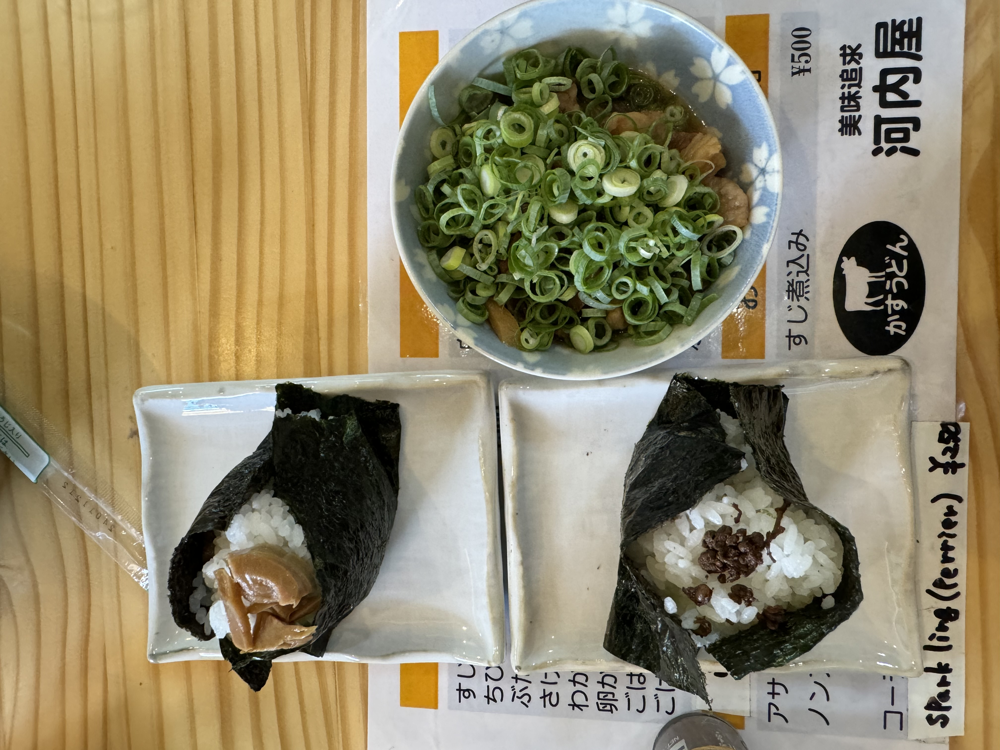
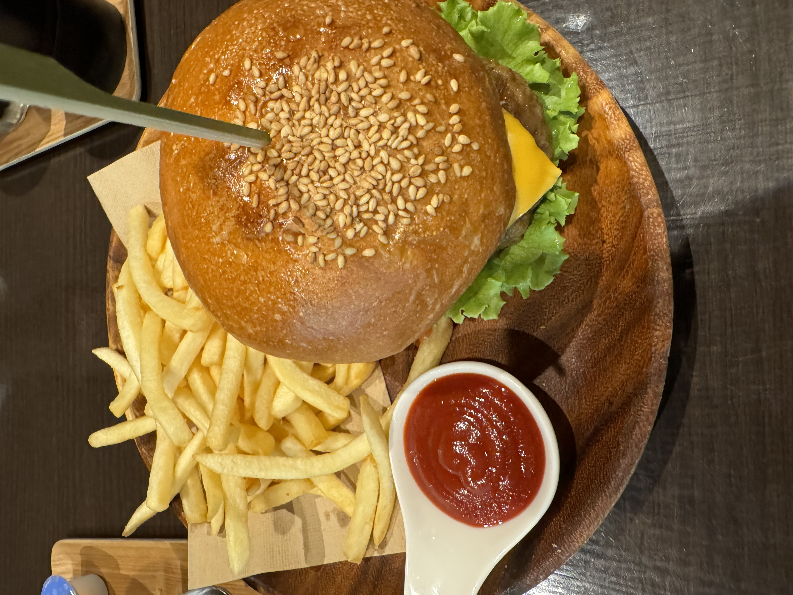

# 高野山(こうやさん) 拜訪大師 2

### 住宿

　　我們在福智院住了四天三夜，並且有訂早餐跟晚餐的精進料理。\
\
精進料理：基本上不會有魚和肉，蛋也沒有。原本我以為是有魚肉的 XD\
不過因為這邊可能外國遊客很多，寺方也是通人性的，餐飲間是可以加點酒的！\
\
溫泉設施：福智院是高野山唯一有溫泉的宿坊。這邊有２個溫泉池，其中一個甚至有露天。洗澡就直接到溫泉的地方囉！有看到一些外國人手足無措。如果你是第一次體驗日本溫泉，請不要太緊張，寺方有提供浴衣，換好浴衣帶著浴巾直接可以到溫泉區清潔身體再泡溫泉。\
\
接待服務：接待人員英文都很好！！請不用擔心。會事先詢問是否需要打掃房間，在一開始入住或每天早上早餐時告知，都可以改變你的決定。\
\
體驗活動：早上有做早課，可以參加。不過他們用的香我不太適應，不然我其實喜歡一起做早課。\
\
其他評論：有在 Google map 看到評論提到，這裡很像旅館不是佛寺。我會說，寺方規畫得很好，看的出來主要是以旅館為運作重點。但這邊其實仍然是佛寺，本尊是愛染明王。\

**福智院**

> 弘仁7年（西暦816年）に弘法大師・空海により開創されてから、真言密教を守り伝えておよそ1200年。高野山では金剛峯寺を中心に117の塔頭寺院が現存しています。福智院（Fukuchiin）についてはそのうちのひとつとして、800余年前に覚印阿闍梨により開かれ、ご本尊は愛染明王という福徳円満所願成就のご利益のある仏様です。 院内には、桜田門外の変で有名な井伊大老をはじめ、ゆかりの諸大名の遺品、古くは奈良時代の古美術品などが納められています。

自弘仁7年（西元816年）弘法大師空海創建以來，真言密教已經傳承了約1200年。在高野山，以金剛峯寺為中心，現存有117座塔頭寺院。福智院（Fukuchiin）是其中之一，約800多年前由覺印阿闍梨開創，其本尊是愛染明王，據說能帶來福德圓滿、願望成就的利益。 院內收藏了許多珍貴文物，包括因櫻田門外之變而聞名的井伊大老相關遺物，以及各個與之有淵源的大名遺品，甚至還有可追溯到奈良時代的古代美術品。\
\
宿坊或精進料理可以直接從官網預定：[https://www.fukuchiin.com/](https://www.fukuchiin.com/)

<figure><figcaption></figcaption></figure>

<figure><figcaption></figcaption></figure>

<figure><figcaption></figcaption></figure>

### 餐廳

由於精進料理是素食（無蛋），如果不太適應，這邊也介紹一些好吃的有肉餐廳。

**かすうどんの河内屋**\
這間烏龍麵店靠近奧之院。推薦烏龍麵＋山椒飯糰！！山椒似乎也是高野山的特產。\
[https://maps.app.goo.gl/jSMCJsxVmWCcoFSo9](https://maps.app.goo.gl/jSMCJsxVmWCcoFSo9)

<figure><figcaption></figcaption></figure>

<figure><figcaption></figcaption></figure>

**丸高 マルタカ**\
這間有賣美式餐點！！所以可以點到漢堡薯條等食物。薯條超好吃！！！店主是異國夫妻經營，店面很舒適，晚上似乎會變身成酒吧？\
[https://maps.app.goo.gl/7LmhV3yHGLFJvQzY9](https://maps.app.goo.gl/7LmhV3yHGLFJvQzY9)

<figure><figcaption></figcaption></figure>

### 務必要做的事

**奧之院**

我們是從「高野山奥之院一の橋」開始做為起點，如果不習慣走路，可以搭車到「奥の院前」靠近「中の橋」附近下車，那邊開始走可以少 1小時。\
奧之院是非常適合慢慢散步沉澱心思的好地方，如果時間允許，從「一の橋」開始很不錯的唷！

<figure><figcaption></figcaption></figure>

<figure><figcaption></figcaption></figure>

**阿字觀**

「अ」字觀，如果比較世俗的用語就是 meditation 冥想。現在很多影片甚至 Netflix 上也有「冥想正念指南」。我個人認為，雖然現在資訊流通快速且方便，但是人生的道路上，有人願意手把手直接教導教流程與心法，我比較偏好直接學習與體驗！\
\
金剛峯寺有阿字觀，但日期上比較有限制，可以考慮參加惠光院的課程，而且有英文教學。\
\
當天飄著細雨，除了偶爾從屋簷低落的雨滴，只能聽到蟲鳴和越過屋頂的鳥鳴。配合老師教導吸氣與吐氣，脖子後腦後會開始漸漸發熱，其實很暢快，心情也平和起來。\
\
惠光院：[https://www.ekoin.jp/](https://www.ekoin.jp/)

### 景點

**壇上伽藍**

<figure><figcaption></figcaption></figure>

**金剛峯寺**

<figure><figcaption></figcaption></figure>

<figure><figcaption></figcaption></figure>

**靈寶館**

<figure><figcaption></figcaption></figure>

_October 03, 2024_
